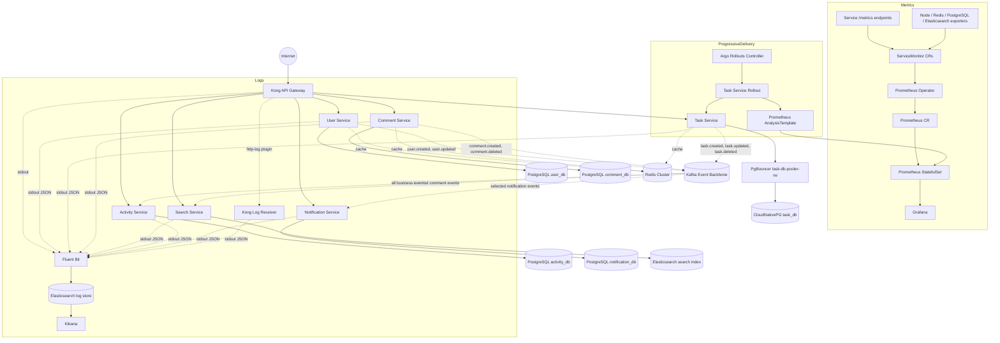

# Production-Style Microservices Platform on Kubernetes

A production-style learning platform for microservices, Kubernetes, event-driven architecture, and observability.

The project now includes independent FastAPI services, database-per-service isolation, Kong Gateway, Redis Cluster caching, Elasticsearch search, Strimzi Kafka, Kafka consumers, operator-managed Prometheus, Grafana dashboards, Fluent Bit logging, Elasticsearch log storage, and Kibana.

## Architecture



## Main Flows

**HTTP request flow**

```text
Client
  -> Kong
  -> service
  -> service database/cache/search backend
```

**Kafka event flow**

```text
user/task/comment service
  -> writes to its own PostgreSQL
  -> publishes event to Kafka
  -> search-service indexes searchable events
  -> activity-service stores audit history
  -> notification-service stores notification records
```

**Metrics flow**

```text
ServiceMonitor CRs
  -> Prometheus Operator
  -> generated scrape config
  -> Prometheus StatefulSet
  -> Grafana
```

**Canary release flow**

```text
new task-service image
  -> Argo Rollouts
  -> 10%, 25%, 50%, 100% canary steps
  -> Prometheus checks error rate and latency
  -> promote or rollback
```

**Log flow**

```text
container stdout/stderr
  -> Fluent Bit
  -> Elasticsearch
  -> Kibana
```

## Services

| Service | Public path | Responsibility | Data store |
|---|---|---|---|
| user-service | `/users` | User accounts and profiles | PostgreSQL + Redis |
| task-service | `/tasks` | Task CRUD and task events | PostgreSQL + Redis |
| comment-service | `/comments` | Comment CRUD and comment events | PostgreSQL + Redis |
| search-service | `/search` | Full-text search from Kafka events | Elasticsearch |
| activity-service | `/activities` | Immutable audit log of Kafka events | PostgreSQL |
| notification-service | `/notifications` | Stored notifications from Kafka events | PostgreSQL |

## Platform Components

| Component | Role |
|---|---|
| Kong Gateway | Public entry point and path routing |
| Redis Cluster | Sharded cache-aside layer for core CRUD services |
| Kafka / Strimzi | Persistent event backbone |
| CloudNativePG | Operator-managed PostgreSQL for task-service |
| PgBouncer | Database connection pooling for task-service |
| Elasticsearch | Search index and log storage |
| Fluent Bit | Kubernetes log collection |
| Kibana | Log exploration |
| Prometheus Operator | Manages Prometheus through CRDs |
| Prometheus | Metrics storage and query engine |
| ServiceMonitor | Declarative scrape target definition |
| Grafana | Metrics dashboards |
| Argo Rollouts | Canary releases and automated rollback |
| AnalysisTemplate | Prometheus-based rollout checks |

## What This Project Demonstrates

- Database-per-service isolation
- Kubernetes Deployments, StatefulSets, Services, Secrets, PVCs, and Jobs
- Operator-managed PostgreSQL with CloudNativePG
- PgBouncer connection pooling for PostgreSQL
- Kong API Gateway routing and plugins
- Redis Cluster cache-aside pattern with key-prefix isolation
- Elasticsearch-backed search
- Strimzi-managed Kafka with replicated topics
- Async Kafka producers with retries and DLQ topics
- Multiple independent Kafka consumers for the same events
- Operator-managed Prometheus with `Prometheus` and `ServiceMonitor` CRDs
- Canary deployment with Argo Rollouts and Prometheus analysis
- Centralized logging with Fluent Bit, Elasticsearch, and Kibana
- Docker Compose parity for local learning

## Kubernetes Deploy Flow

### 1. Core Namespace And Shared Infra

```bash
kubectl apply -f k8s/namespace.yaml
kubectl apply -f k8s/secret.yaml
kubectl apply -f k8s/redis-cluster.yaml
kubectl rollout status statefulset/redis-cluster -n task-api --timeout=300s
kubectl wait --for=condition=complete job/redis-cluster-init -n task-api --timeout=300s
kubectl apply -f k8s/elasticsearch-deployment.yaml
```

### 2. Kafka

```bash
kubectl apply -f k8s/kafka/namespace.yaml
kubectl create -f https://strimzi.io/install/latest?namespace=kafka -n kafka
kubectl wait deployment/strimzi-cluster-operator -n kafka --for=condition=Available --timeout=300s
kubectl apply -f k8s/kafka/kafka-cluster.yaml
kubectl apply -f k8s/kafka/topics.yaml
```

### 3. CloudNativePG For Task Database

```bash
kubectl apply --server-side -f https://raw.githubusercontent.com/cloudnative-pg/cloudnative-pg/release-1.30/releases/cnpg-1.30.0.yaml
kubectl wait deployment/cnpg-controller-manager -n cnpg-system --for=condition=Available --timeout=300s

kubectl apply -f task-service/k8s/postgres-cnpg.yaml
kubectl wait cluster/task-db -n task-api --for=condition=Ready --timeout=600s
kubectl apply -f task-service/k8s/pooler.yaml
```

### 4. Other Databases

```bash
kubectl apply -f user-service/k8s/postgres.yaml
kubectl apply -f comment-service/k8s/postgres.yaml
kubectl apply -f activity-service/k8s/postgres.yaml
kubectl apply -f notification-service/k8s/postgres.yaml
```

Do not apply `task-service/k8s/postgres-statefulset-manual.yaml` when using CloudNativePG for `task-service`.

### 5. Migrations

```bash
kubectl apply -f user-service/k8s/migration-job.yaml
kubectl apply -f task-service/k8s/migration-job.yaml
kubectl apply -f comment-service/k8s/migration-job.yaml
kubectl apply -f activity-service/k8s/migration-job.yaml
kubectl apply -f notification-service/k8s/migration-job.yaml

kubectl wait --for=condition=complete job/user-service-migrations -n task-api --timeout=300s
kubectl wait --for=condition=complete job/task-service-migrations -n task-api --timeout=300s
kubectl wait --for=condition=complete job/comment-service-migrations -n task-api --timeout=300s
kubectl wait --for=condition=complete job/activity-service-migrations -n task-api --timeout=300s
kubectl wait --for=condition=complete job/notification-service-migrations -n task-api --timeout=300s
```

### 6. Services And Gateway

```bash
kubectl apply -f user-service/k8s/deployment.yaml
kubectl apply -f task-service/k8s/deployment.yaml
kubectl apply -f comment-service/k8s/deployment.yaml
kubectl apply -f search-service/k8s/deployment.yaml
kubectl apply -f activity-service/k8s/deployment.yaml
kubectl apply -f notification-service/k8s/deployment.yaml

kubectl apply -f kong-gateway/k8s/
```

### 7. Operator-Managed Prometheus

```bash
kubectl apply -f k8s/monitoring/namespace.yaml
```

Install pinned Prometheus Operator `v0.93.0`:

```bash
OPERATOR_VERSION=v0.93.0
TMPDIR=$(mktemp -d)

curl -sL "https://raw.githubusercontent.com/prometheus-operator/prometheus-operator/refs/tags/${OPERATOR_VERSION}/kustomization.yaml" > "${TMPDIR}/kustomization.yaml"
curl -sL "https://raw.githubusercontent.com/prometheus-operator/prometheus-operator/refs/tags/${OPERATOR_VERSION}/bundle.yaml" > "${TMPDIR}/bundle.yaml"

cd "${TMPDIR}"
kustomize edit set namespace monitoring
kubectl apply -k "${TMPDIR}"

kubectl wait pod -n monitoring -l app.kubernetes.io/name=prometheus-operator --for=condition=Ready --timeout=300s
```

Apply platform monitoring:

```bash
kubectl apply -f k8s/monitoring/prometheus-rbac.yaml
kubectl apply -f k8s/monitoring/postgres-exporter.yaml
kubectl apply -f k8s/monitoring/redis-exporter.yaml
kubectl apply -f k8s/monitoring/elasticsearch-exporter.yaml
kubectl apply -f k8s/monitoring/node-exporter.yaml
kubectl apply -f k8s/monitoring/kube-state-metrics.yaml
kubectl apply -f k8s/monitoring/service-monitors.yaml
kubectl apply -f k8s/monitoring/prometheus-managed.yaml
kubectl apply -f k8s/monitoring/grafana-dashboards.yaml
kubectl apply -f k8s/monitoring/grafana-deployment.yaml
```

### 8. Argo Rollouts For Task Service

```bash
kubectl create namespace argo-rollouts
kubectl apply -n argo-rollouts -f https://github.com/argoproj/argo-rollouts/releases/v1.9.0/download/install.yaml
kubectl wait deployment/argo-rollouts -n argo-rollouts --for=condition=Available --timeout=300s

kubectl apply -f task-service/k8s/analysis-template.yaml
kubectl delete deployment task-service -n task-api
kubectl apply -f task-service/k8s/rollout.yaml
```

### 9. Logging

```bash
kubectl apply -f k8s/kibana-deployment.yaml
kubectl apply -f k8s/fluentbit/configmap.yaml
kubectl apply -f k8s/fluentbit/daemonset.yaml
kubectl apply -f kong-gateway/k8s/log-receiver.yaml
kubectl apply -f kong-gateway/k8s/log-endpoint.yaml
kubectl apply -f kong-gateway/k8s/configmap.yaml
kubectl rollout restart deployment/kong-gateway -n task-api
```

## Testing

Through Kong:

```bash
curl http://localhost:8888/users/
curl http://localhost:8888/tasks/
curl http://localhost:8888/comments/
curl "http://localhost:8888/search/?q=example"
curl "http://localhost:8888/activities/?event_type=task.created"
curl "http://localhost:8888/notifications/?type=task_created"
```

Kafka event test:

```bash
curl -X POST http://localhost:8888/tasks/ \
  -H "Content-Type: application/json" \
  -d '{"title":"Kafka test","description":"event test","user_id":"u1"}'

curl "http://localhost:8888/activities/?event_type=task.created"
curl "http://localhost:8888/notifications/?type=task_created"
curl "http://localhost:8888/search/?q=Kafka"
```

## Useful Docs

- [Kafka stack](docs/kafka-stack.md)
- [Activity service](docs/activity-service.md)
- [Notification service](docs/notification-service.md)
- [CloudNativePG](docs/cloudnative-pg.md)
- [PostgreSQL cutover](docs/postgres-cutover.md)
- [Redis Cluster](docs/redis-cluster.md)
- [Prometheus stack](docs/prometheus-stack.md)
- [Operator and CRD](docs/operator-crd.md)
- [Argo Rollouts](docs/argo-rollouts.md)
- [ELK stack](docs/elk-stack.md)
- [Kafka tests](docs/test-kafka.md)
- [Production checklist](docs/production-checklist.md)

## Docker Compose

For local learning:

```bash
docker compose up -d
```

The Compose stack keeps local parity for services, databases, Redis, Kafka, Kong, Elasticsearch, Prometheus, Grafana, Kibana, and Fluent Bit.

Use Kong in Compose:

```bash
curl http://localhost:8888/users/
curl http://localhost:8888/tasks/
curl http://localhost:8888/comments/
curl http://localhost:8888/search/
curl http://localhost:8888/activities/
curl http://localhost:8888/notifications/
```

Swagger docs through Kong:

```text
http://localhost:8888/users/docs
http://localhost:8888/tasks/docs
http://localhost:8888/comments/docs
http://localhost:8888/search/docs
http://localhost:8888/activities/docs
http://localhost:8888/notifications/docs
```

## Author

Mahdi Lotfilo - DevOps Engineer

GitHub: [github.com/wolfixor](https://github.com/wolfixor)
