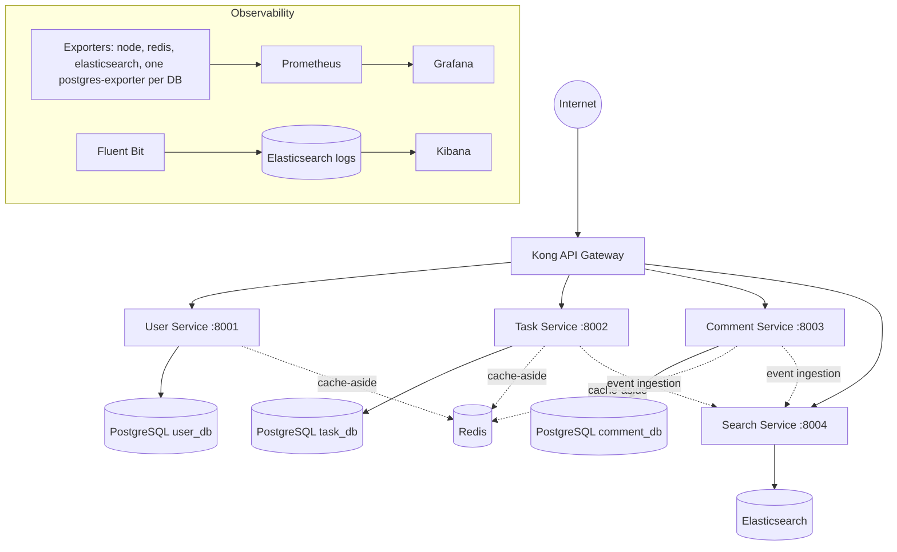

# Production-Style Microservices Platform on Kubernetes

A complete, production-style microservice architecture built to demonstrate how real systems are designed, deployed, and operated: independent FastAPI services with isolated databases, an API gateway, cache-aside Redis caching, full-text search, database migration jobs, and a full observability stack (metrics, dashboards, and centralized logging) — deployable to Kubernetes/K3s or Docker Compose.

> Most of my production work (map.ir, Iran Post GNAF — ~260 microservices across 25 nodes) lives in private repositories. This project is the public window into how I design and run infrastructure.

## Architecture



**Request flow:** external traffic enters through Kong, which routes to the appropriate service. Each service owns its data (database-per-service), reads through Redis with a cache-aside pattern, and exposes `/health` and `/ready` probes consumed by Kubernetes. Task and comment events are ingested into Elasticsearch for full-text search. Every component ships metrics to Prometheus and logs through Fluent Bit into Elasticsearch/Kibana.

## What This Project Demonstrates

- **Database-per-service isolation** — each service has its own PostgreSQL instance; no shared schemas.
- **Safe schema migrations** — Alembic migrations run as Kubernetes Jobs *before* service rollout, gated with `kubectl wait`.
- **Cache-aside caching** — Redis read-through with automatic invalidation on writes, per-service Redis databases, 5-minute TTL with LRU eviction, and graceful degradation when Redis is down.
- **API gateway routing** — Kong terminates external traffic and routes per path.
- **Kubernetes-native health** — liveness (`/health`) and readiness (`/ready`) probes on every service; Redis health is part of readiness.
- **Full observability** — Prometheus scraping node, Redis, Elasticsearch, and per-database Postgres exporters; provisioned Grafana dashboards; centralized logging with Fluent Bit → Elasticsearch → Kibana.
- **Two deployment targets** — the same system runs on Kubernetes/K3s (manifests per service) or locally via a single `docker-compose.yml` (20 containers).

## Services

| Service | Port | Responsibility | Data Store |
|---|---|---|---|
| user-service | 8001 | User accounts and profiles (`/api/users`) | PostgreSQL + Redis |
| task-service | 8002 | Tasks with status tracking (`/api/tasks`) | PostgreSQL + Redis |
| comment-service | 8003 | Comments on tasks (`/api/comments`) | PostgreSQL + Redis |
| search-service | 8004 | Full-text search across tasks and comments (`/api/search`) | Elasticsearch |

Every service is FastAPI-based with structured logging, environment-based configuration, its own Dockerfile, and its own Kubernetes manifests — independently buildable and deployable.

### Search Service

- Elasticsearch-powered full-text search across tasks and comments
- Multi-field matching (title, content, description) with auto-fuzziness
- Score-based ranking with recency bias
- HTTP-based event ingestion from task and comment services (Kafka replaces this in the roadmap)

## Quick Start — Docker Compose

The fastest way to run the entire platform, including the observability stack:

```bash
docker compose up -d
```

This brings up all four services, their PostgreSQL instances, Redis, Elasticsearch, Kong-equivalent routing, Prometheus with all exporters, Grafana, Kibana, and Fluent Bit.

## Deploying to Kubernetes

### 1. Build the images

```bash
for svc in user-service task-service comment-service search-service; do
  docker build -t $svc ./$svc
done
```

### 2. Core infrastructure

```bash
kubectl apply -f k8s/namespace.yaml
kubectl apply -f k8s/secret.yaml               # DB + Redis credentials
kubectl apply -f k8s/redis-deployment.yaml
kubectl apply -f k8s/elasticsearch-deployment.yaml
```

### 3. Databases and migrations

Migrations run as Jobs and must complete before the services start:

```bash
kubectl apply -f user-service/k8s/postgres.yaml
kubectl apply -f task-service/k8s/postgres.yaml
kubectl apply -f comment-service/k8s/postgres.yaml

kubectl apply -f user-service/k8s/migration-job.yaml
kubectl apply -f task-service/k8s/migration-job.yaml
kubectl apply -f comment-service/k8s/migration-job.yaml

kubectl wait --for=condition=complete job/user-service-migrations    -n task-api --timeout=300s
kubectl wait --for=condition=complete job/task-service-migrations    -n task-api --timeout=300s
kubectl wait --for=condition=complete job/comment-service-migrations -n task-api --timeout=300s
```

### 4. Services and gateway

```bash
kubectl apply -f user-service/k8s/deployment.yaml
kubectl apply -f task-service/k8s/deployment.yaml
kubectl apply -f comment-service/k8s/deployment.yaml
kubectl apply -f search-service/k8s/deployment.yaml

kubectl apply -f kong-gateway/k8s/
```

### 5. Verify

```bash
kubectl get pods -n task-api
kubectl get svc  -n task-api
kubectl get service kong-gateway -n task-api   # external IP
```

## Testing

Through the gateway (external path):

```bash
KONG_IP=$(kubectl get service kong-gateway -n task-api -o jsonpath='{.status.loadBalancer.ingress[0].ip}')

curl http://$KONG_IP/users
curl http://$KONG_IP/tasks
curl http://$KONG_IP/comments
curl "http://$KONG_IP/search?q=example"
```

Direct service access (internal):

```bash
curl http://localhost:8001/health && curl http://localhost:8001/api/users
curl http://localhost:8002/health && curl http://localhost:8002/api/tasks
curl http://localhost:8003/health && curl http://localhost:8003/api/comments
curl http://localhost:8004/health && curl "http://localhost:8004/api/search?q=example"
```

## Observability

- **Metrics:** Prometheus scrapes node-exporter, redis-exporter, elasticsearch-exporter, and a postgres-exporter per database.
- **Dashboards:** Grafana with provisioned datasources and dashboards (`grafana/`).
- **Logs:** Fluent Bit collects container logs and ships them to Elasticsearch; Kibana provides analysis (`conf/`, see [docs/LOG_FLOW.md](docs/LOG_FLOW.md)).

## Repository Layout

```
├── user-service/       # FastAPI service + Dockerfile + k8s manifests
├── task-service/
├── comment-service/
├── search-service/
├── kong-gateway/       # Kong API gateway manifests
├── k8s/                # Namespace, secrets, Redis, Elasticsearch, monitoring
├── prometheus/         # Scrape configuration
├── grafana/            # Datasources + provisioned dashboards
├── conf/               # Fluent Bit + Kibana configuration
├── redis/              # Caching cookbook + utilities
├── docs/               # Deployment guides, migration guides, cookbooks
└── docker-compose.yml  # Full local stack (20 containers)
```

The [docs/](docs/) folder contains detailed guides: deployment, environment configuration, database architecture, Redis caching patterns, log flow, and migration strategy.

## Roadmap — Target Architecture

The next phase replaces HTTP event ingestion with an event-driven backbone and adds platform-grade services:

- **Kafka** event bus replacing HTTP ingestion (notification, activity, and search consumers)
- **Argo Rollouts** for canary and blue/green deployments
- **Velero** backups and **Rook-Ceph** distributed storage
- PostgreSQL HA (primary + replicas), 3-broker Kafka, Redis cluster
- Search analytics, faceted search, autocomplete, relevance tuning

```

                                         Internet
                                             |
                                             |
                                      +-------------+
                                      |    Kong     |
                                      |   Gateway   |
                                      +-------------+
                                             |
      --------------------------------------------------------------------------------
      |                    |                    |                    |                |
      v                    v                    v                    v                v

+-------------+    +-------------+    +-------------+    +-------------+    +------------------+
| User        |    | Task        |    | Comment     |    | Search      |    | Notification     |
| Service     |    | Service     |    | Service     |    | Service     |    | Service          |
+-------------+    +-------------+    +-------------+    +-------------+    +------------------+
      |                    |                    |                    |                |
      |                    |                    |                    |                |
      v                    v                    v                    v                |
+-------------+    +-------------+    +-------------+    +------------------+        |
| PostgreSQL  |    | PostgreSQL  |    | PostgreSQL  |    | Elasticsearch    |        |
+-------------+    +-------------+    +-------------+    +------------------+        |
      |                    |                    |                    ^                |
      |                    |                    |                    |                |
      ---------------------------------------------------------------------------------
                                             |
                                             v
                                      +-------------+
                                      |    Kafka    |
                                      |  Cluster    |
                                      +-------------+
                                             |
                    -------------------------------------------------
                    |                       |                       |
                    v                       v                       v

             +-------------+       +------------------+    +------------------+
             | Activity    |       | Notification     |    | Search Service   |
             | Service     |       | Service          |    | Kafka Consumer   |
             +-------------+       +------------------+    +------------------+
                    |
                    v
             +-------------+
             | PostgreSQL  |
             | activity_db |
             +-------------+


========================================================================================
                               SHARED PLATFORM SERVICES
========================================================================================

+------------------+      +------------------+      +------------------+
| Redis Cluster    |      | Prometheus       |      | Grafana          |
| Cache Layer      |      | Metrics          |      | Dashboards       |
+------------------+      +------------------+      +------------------+

+------------------+      +------------------+      +------------------+
| Fluent Bit       | ---> | Elasticsearch    | ---> | Kibana           |
| Log Collection   |      | Log Storage      |      | Log Analysis     |
+------------------+      +------------------+      +------------------+

+------------------+
| Argo Rollouts    |
| Canary/BlueGreen |
+------------------+

+------------------+
| Velero           |
| Backups          |
+------------------+

+------------------+
| Rook-Ceph        |
| Storage Layer    |
+------------------+


========================================================================================
                                   STORAGE LAYER
========================================================================================

                          +------------------------+
                          |      Rook-Ceph         |
                          | Distributed Storage    |
                          +------------------------+
                                       |
            ----------------------------------------------------------------
            |                    |                    |                     |
            v                    v                    v                     v

    PostgreSQL HA        Kafka Cluster       Elasticsearch       Backup Storage
    (Primary+Replicas)   (3 Brokers)         Persistent Data     (Velero)

            |
            v

      Redis Cluster

```

## Author

**Mahdi Lotfilo** — DevOps Engineer
GitHub: [github.com/wolfixor](https://github.com/wolfixor) · Email: wolfix007.xiflow@gmail.com
