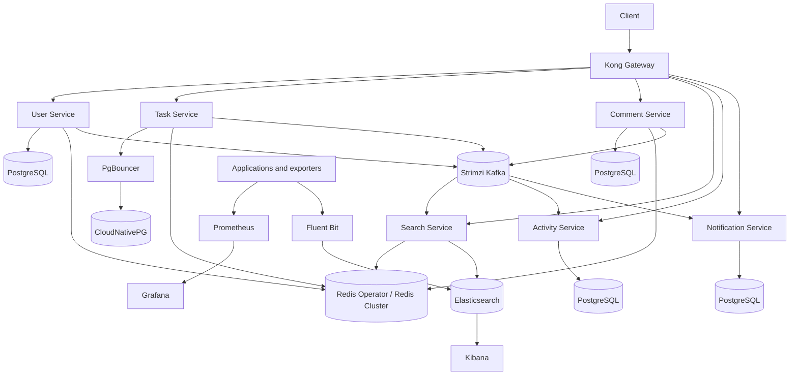

# Microservices Kubernetes Platform

A production-style learning platform for operating FastAPI microservices on
Kubernetes. Git is the desired-state source, Argo CD reconciles platform and
application resources, and operators own stateful systems.

## Architecture



## Delivery Flow

```text
Git commit
  -> Argo CD root application
  -> child applications
  -> Kustomize renders desired resources
  -> Kubernetes admission and Kyverno validation
  -> operators reconcile custom resources
  -> Argo Rollouts releases task-service progressively
  -> Prometheus, logs, and Kubernetes events verify health
```

Argo CD owns long-running platform and application resources. Files under an
`operations/` directory are deliberate one-shot actions and are never
autosynced.

## Repository Layout

```text
services/<service>/                application source, tests, image definition
deploy/compose/config/             Docker Compose component configuration
k8s/apps/<service>/base/           deployable application resources
k8s/apps/<service>/operations/     migrations, backup, restore, and drills
k8s/platform/<component>/base/     shared platform desired state
k8s/environments/local/            local composition and local-only tooling
k8s/operators/                     pinned operator installation with Helmfile
k8s/operators/raw/                 offline recovery bundles only
k8s/argocd/                        AppProject and app-of-apps definitions
k8s/security-drills/               manual validation resources, never autosynced
docs/concepts/                     short mental models
docs/commands/                     deployment, verification, and recovery commands
```

## Ownership Rules

- Install controllers and CRDs with `k8s/operators/helmfile.yaml.gotmpl`.
- Reconcile application and platform desired state through Argo CD.
- Use Kustomize as the render boundary for every Argo CD application.
- Keep local-only dependencies under `k8s/environments/local`.
- Never store live credentials in Git; Vault and External Secrets create them.
- Never apply an offline raw operator bundle beside the equivalent Helm release.
- Never place migration, restore, load-test, or security-drill resources in an
  autosynced Kustomization.

## Bootstrap

Render before changing a cluster:

```bash
kubectl kustomize k8s/argocd
kubectl kustomize k8s/environments/local/apps
kubectl kustomize k8s/platform/observability/base
helmfile -f k8s/operators/helmfile.yaml.gotmpl -e prod template
```

Install the pinned operators on a new production cluster:

```bash
helmfile -f k8s/operators/helmfile.yaml.gotmpl -e prod diff
helmfile -f k8s/operators/helmfile.yaml.gotmpl -e prod apply
```

Bootstrap GitOps after Argo CD is available:

```bash
kubectl apply -f k8s/argocd/projects/task-api-platform.yaml
kubectl apply -f k8s/argocd/applications/platform-root.yaml
kubectl get applications -n argocd
```

The local cluster has additional Vault and backup lab prerequisites. Follow
[Start Here](docs/START-HERE.md) and the component command docs instead of
blindly applying the whole repository.

## Services

| Service | Kong path | Data path |
|---|---|---|
| user-service | `/users` | PostgreSQL, Redis, Kafka producer |
| task-service | `/tasks` | CloudNativePG, PgBouncer, Redis, Kafka producer |
| comment-service | `/comments` | PostgreSQL, Redis, Kafka producer |
| search-service | `/search` | Redis, Kafka consumer, Elasticsearch |
| activity-service | `/activities` | Kafka consumer, PostgreSQL |
| notification-service | `/notifications` | Kafka consumer, PostgreSQL |

## Verification

```bash
kubectl get applications -n argocd
kubectl get pods -n task-api
kubectl get kafka -n kafka
kubectl get cluster,pooler -n task-api
kubectl get prometheus,alertmanager -n monitoring
kubectl get externalsecret,secretstore -n task-api
```

Smoke-test through Kong:

```bash
curl http://localhost:8888/users/
curl http://localhost:8888/tasks/
curl http://localhost:8888/comments/
curl "http://localhost:8888/search/?q=example"
curl "http://localhost:8888/activities/?event_type=task.created"
curl "http://localhost:8888/notifications/?type=task_created"
```

## Local Compose

Docker Compose remains a separate local development path:

```bash
docker compose config --quiet
docker compose up -d
```

It is not the production deployment source and is not reconciled by Argo CD.
Its component configuration lives under `deploy/compose/config`; Kubernetes
configuration remains under `k8s` and does not reuse Compose files.

## Documentation

- [Start Here](docs/START-HERE.md)
- [Current Architecture](docs/architecture/current-state.md)
- [Apply and Reconciliation Flow](docs/architecture/apply-flow.md)
- [CRD Ownership Map](docs/architecture/crd-map.md)
- [Learning Roadmap](docs/roadmap.md)
- [Concept Index](docs/concepts/README.md)
- [Command and Runbook Index](docs/commands/README.md)

## Author

Mahdi Lotfilo - DevOps Engineer

GitHub: [github.com/wolfixor](https://github.com/wolfixor)
